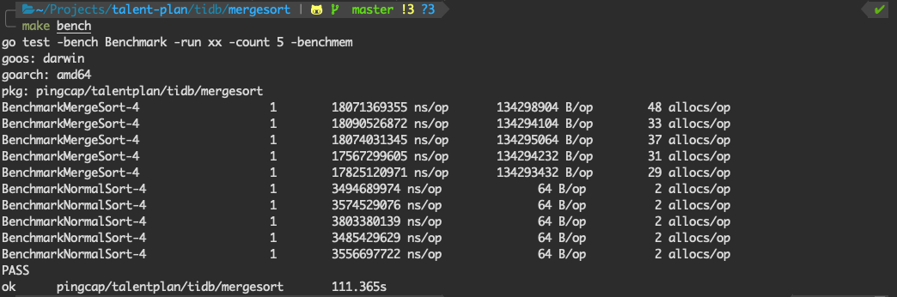
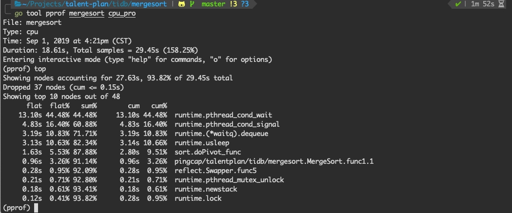

# Distributed Systems in Go

* Week 1: [Merge Sort](./mergesort)

1. 利用多核，每个核跑一个系统自带的排序，最后使用归并排序算法归并结果，但是结果很差。平均执行时间大约为系统自带排序的6倍。内存占用也大的离谱。

   

   试着用go profile分析一下，发现`runtime.pthread_cond_wait`和`runtime.pthrad_cond_signal`占了60%的时间。

   

   归并部分的代码如下所示，为了使用golang的channel和goroutine的特性，首先在`subMerge`函数内部执行一个匿名的协程函数，通过channel传递排好序的子序列。

   ```go
   func merge(input ...<-chan int64) <-chan int64{
   	if len(input) == 1 {
   		return input[0]
   	}
   	mid := len(input)/2
   	return subMerge(merge(input[:mid]...), merge(input[mid:]...))
   }
   
   func subMerge(input1, input2 <-chan int64) <-chan int64{
   	out := make(chan int64)
   	go func() {
   		item1, ok1 := <- input1
   		item2, ok2 := <- input2
   		for ok1 || ok2 {
   			if !ok1 || (ok2 && item2 <= item1) {
   				out <- item2
   				item2, ok2 = <-input2
   			} else {
   				out <- item1
   				item1, ok1 = <-input1
   			}
   		}
   		close(out)
   	}()
   	return out
   }
   ```

   但是在main函数的实现中，将部分排好序的子序列塞到缓冲channel里面，不仅消耗了大量内存，还造成了资源竞争导致了golang在调度方面耗费了大量时间。

2. 尝试第二种方法

* Week 2: [Map Reduce](./mapreduce)
* Week 4: [Parallel Join](./join)

