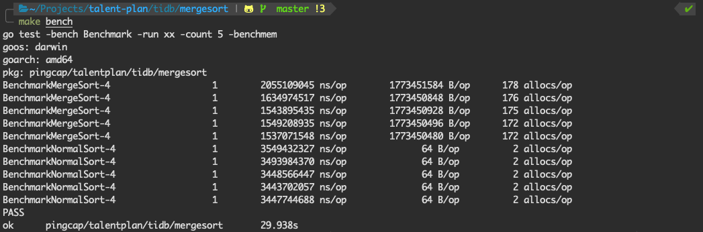

# Distributed Systems in Go

* Week 1: [Merge Sort](./mergesort)

1. 利用多核，每个核跑一个系统自带的排序，最后使用归并排序算法归并结果，但是结果很差。平均执行时间大约为系统自带排序的6倍。内存占用也大的离谱。

   

   试着用go profile分析一下，发现`runtime.pthread_cond_wait`和`runtime.pthrad_cond_signal`占了60%的时间。

   

   归并部分的代码如下所示，为了使用golang的channel和goroutine的特性，首先在`subMerge`函数内部执行一个匿名的协程函数，通过channel传递排好序的子序列。

   ```go
   func merge(input ...<-chan int64) <-chan int64{
   	if len(input) == 1 {
   		return input[0]
   	}
   	mid := len(input)/2
   	return subMerge(merge(input[:mid]...), merge(input[mid:]...))
   }
   
   func subMerge(input1, input2 <-chan int64) <-chan int64{
   	out := make(chan int64)
   	go func() {
   		item1, ok1 := <- input1
   		item2, ok2 := <- input2
   		for ok1 || ok2 {
   			if !ok1 || (ok2 && item2 <= item1) {
   				out <- item2
   				item2, ok2 = <-input2
   			} else {
   				out <- item1
   				item1, ok1 = <-input1
   			}
   		}
   		close(out)
   	}()
   	return out
   }
   ```

   但是在main函数的实现中，启动多个个goroutine将部分排好序的子序列依次塞到缓冲channel里面，在`subMerge`函数中取出并排序，导致了golang在调度方面耗费了大量时间。

2. 总体思路还是将数据分成和核数目一样多的分片，交给不同的核进行排序，然后收集各个排好序之后的子序列，进行归并排序，但是这次使用的归并排序，没有使用channel和goroutine。

   ```go
   func merge(in... []int64) []int64{
   	if len(in) == 1 {
   		return in[0]
   	}
   	mid := len(in)/2
   	return subMerge(merge(in[:mid]...), merge(in[mid:]...))
   }
   
   func subMerge(in1, in2 []int64) []int64{
   	var res []int64
   	leftIdx, rightIdx := 0,0
   	leftLen, rightLen := len(in1), len(in2)
   
   	for leftIdx < leftLen && rightIdx < rightLen {
   		if in1[leftIdx] < in2[rightIdx] {
   			res = append(res, in1[leftIdx])
   			leftIdx += 1
   		} else {
   			res = append(res, in2[rightIdx])
   			rightIdx += 1
   		}
   	}
     
   	res = append(res, in1[leftIdx:]...)
   	res = append(res, in2[rightIdx:]...)
   	return res
   }
   ```

   最后Bench结果如下所示

   

   可以看到确实起到了加速的效果，但是内存占用还是很大，因为将数组分成不同的部分分发到各个goroutine。

   用go profile分析了一下，最耗时的函数是排序函数。

   

* Week 2: [Map Reduce](./mapreduce)
* Week 4: [Parallel Join](./join)

