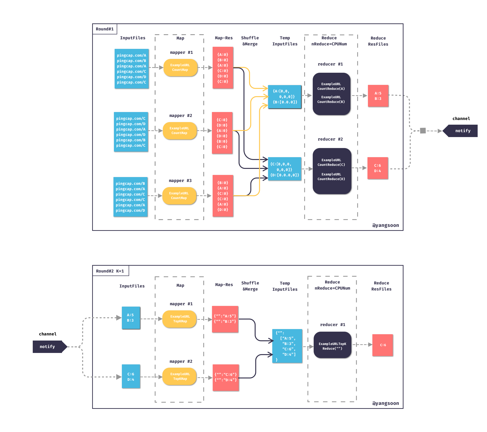

## Introduction

This is the Map-Reduce homework for PingCAP Talent Plan Online of week 2.

There is a uncompleted Map-Reduce framework, you should complete it and use it to extract the 10 most frequent URLs from data files.

## Getting familiar with the source

The simple Map-Reduce framework is defined in `mapreduce.go`.

It is uncompleted and you should fill your code below comments `YOUR CODE HERE`.

The map and reduce function are defined as same as MIT 6.824 lab 1.
```
type ReduceF func(key string, values []string) string
type MapF func(filename string, contents string) []KeyValue
```

There is an example in `urltop10_example.go` which is used to extract the 10 most frequent URLs.

After completing the framework, you can run this example by `make test_example`.

And then please implement your own `MapF` and `ReduceF` in `urltop10.go` to accomplish this task.

After filling your code, please use `make test_homework` to test.

All data files will be generated at runtime, and you can use `make cleanup` to clean all test data.

Please output URLs by lexicographical order and ensure that your result has the same format as test data so that you can pass all tests.

Each test cases has **different data distribution** and you should take it into account.

## Requirements and rating principles

* (40%) Performs better than `urltop10_example`.
* (20%) Pass all test cases.
* (30%) Have a document to describe your idea and record the process of performance optimization (both the framework and your own code) with `pprof`.
* (10%) Have a good code style.

NOTE: **go 1.12 is required**

## How to use

Fill your code below comments `YOUR CODE HERE` in `mapreduce.go` to complete this framework.

Implement your own `MapF` and `ReduceF` in `urltop10.go` and use `make test_homework` to test it.

There is a builtin unit test defined in `urltop10_test.go`, however, you still can write your own unit tests.

How to run example:
```
make test_example
```

How to test your implementation:
```
make test_homework
```

How to clean up all test data:
```
make cleanup
```

How to generate test data again:
```
make gendata
```

## 实验报告

### 实验结果

```shell
make test_homework
go test -v -run=TestURLTop -timeout=20m
=== RUN   TestURLTop
Case0 PASS, dataSize=1MB, nMapFiles=5, cost=15.252723ms
Case1 PASS, dataSize=1MB, nMapFiles=5, cost=13.985207ms
Case2 PASS, dataSize=1MB, nMapFiles=5, cost=10.857452ms
Case3 PASS, dataSize=1MB, nMapFiles=5, cost=36.515872ms
Case4 PASS, dataSize=1MB, nMapFiles=5, cost=45.720862ms
Case5 PASS, dataSize=1MB, nMapFiles=5, cost=8.11681ms
Case6 PASS, dataSize=1MB, nMapFiles=5, cost=9.484432ms
Case7 PASS, dataSize=1MB, nMapFiles=5, cost=8.609927ms
Case8 PASS, dataSize=1MB, nMapFiles=5, cost=13.522972ms
Case9 PASS, dataSize=1MB, nMapFiles=5, cost=13.754726ms
Case10 PASS, dataSize=1MB, nMapFiles=5, cost=8.85537ms
Case0 PASS, dataSize=10MB, nMapFiles=10, cost=29.353604ms
Case1 PASS, dataSize=10MB, nMapFiles=10, cost=25.887663ms
Case2 PASS, dataSize=10MB, nMapFiles=10, cost=28.145605ms
Case3 PASS, dataSize=10MB, nMapFiles=10, cost=124.192422ms
Case4 PASS, dataSize=10MB, nMapFiles=10, cost=351.065391ms
Case5 PASS, dataSize=10MB, nMapFiles=10, cost=25.943889ms
Case6 PASS, dataSize=10MB, nMapFiles=10, cost=26.579916ms
Case7 PASS, dataSize=10MB, nMapFiles=10, cost=26.825025ms
Case8 PASS, dataSize=10MB, nMapFiles=10, cost=54.322984ms
Case9 PASS, dataSize=10MB, nMapFiles=10, cost=57.368284ms
Case10 PASS, dataSize=10MB, nMapFiles=10, cost=25.156917ms
Case0 PASS, dataSize=100MB, nMapFiles=20, cost=169.519274ms
Case1 PASS, dataSize=100MB, nMapFiles=20, cost=158.753297ms
Case2 PASS, dataSize=100MB, nMapFiles=20, cost=192.766038ms
Case3 PASS, dataSize=100MB, nMapFiles=20, cost=412.692097ms
Case4 PASS, dataSize=100MB, nMapFiles=20, cost=3.525838885s
Case5 PASS, dataSize=100MB, nMapFiles=20, cost=155.941815ms
Case6 PASS, dataSize=100MB, nMapFiles=20, cost=150.832533ms
Case7 PASS, dataSize=100MB, nMapFiles=20, cost=143.09943ms
Case8 PASS, dataSize=100MB, nMapFiles=20, cost=326.409926ms
Case9 PASS, dataSize=100MB, nMapFiles=20, cost=360.033779ms
Case10 PASS, dataSize=100MB, nMapFiles=20, cost=170.866633ms
Case0 PASS, dataSize=500MB, nMapFiles=40, cost=1.023166465s
Case1 PASS, dataSize=500MB, nMapFiles=40, cost=875.27209ms
Case2 PASS, dataSize=500MB, nMapFiles=40, cost=883.850602ms
Case3 PASS, dataSize=500MB, nMapFiles=40, cost=1.441801894s
Case4 PASS, dataSize=500MB, nMapFiles=40, cost=15.604020984s
Case5 PASS, dataSize=500MB, nMapFiles=40, cost=843.779825ms
Case6 PASS, dataSize=500MB, nMapFiles=40, cost=668.798865ms
Case7 PASS, dataSize=500MB, nMapFiles=40, cost=680.748046ms
Case8 PASS, dataSize=500MB, nMapFiles=40, cost=1.19898088s
Case9 PASS, dataSize=500MB, nMapFiles=40, cost=1.184320055s
Case10 PASS, dataSize=500MB, nMapFiles=40, cost=878.084649ms
Case0 PASS, dataSize=1GB, nMapFiles=60, cost=1.585902212s
Case1 PASS, dataSize=1GB, nMapFiles=60, cost=1.645816069s
Case2 PASS, dataSize=1GB, nMapFiles=60, cost=1.726014583s
Case3 PASS, dataSize=1GB, nMapFiles=60, cost=2.986537283s
Case4 PASS, dataSize=1GB, nMapFiles=60, cost=30.434269406s
Case5 PASS, dataSize=1GB, nMapFiles=60, cost=1.770623857s
Case6 PASS, dataSize=1GB, nMapFiles=60, cost=1.803911532s
Case7 PASS, dataSize=1GB, nMapFiles=60, cost=1.564552633s
Case8 PASS, dataSize=1GB, nMapFiles=60, cost=2.224590624s
Case9 PASS, dataSize=1GB, nMapFiles=60, cost=2.301024641s
Case10 PASS, dataSize=1GB, nMapFiles=60, cost=1.662136729s
--- PASS: TestURLTop (82.38s)
PASS
ok  	talent	82.628s
```


### 实现和优化

1. 任务一，补全 `mapreduce.go`文件中的相应的代码之后，`make test_example` 可以正常执行。

   `mapreduce.go - MRCluster.worker`

   `MRCluster.worker`函数针对不同类型的任务做不同的处理，这个函数需要我们实现当任务为reduce类型的任务时需要进行的操作。

   reduce任务可以分成2步：首先，reduce任务收集属于同一个关键字的所有值，这里用`[]string`存储一个键对应的所有值，用`map[string] []string`来存储所有的键的信息。然后迭代map中的键值对，交由`reduceF`来对每个键的 值集合 进行处理并得出结果，并输出到相应的文件中。

   这部分的代码如下所示：

   ```go
   fw, bw := CreateFileAndBuf(mergeName(t.dataDir, t.jobName, t.taskNumber))
   kvMap := make(map[string] []string)
   
   for i:=0; i < t.nMap; i++ {
   	rpath := reduceName(t.dataDir, t.jobName, i, t.taskNumber)
   
   	file, err := os.Open(rpath)
   	if err != nil {
   		panic(err)
   	}
   	decoder := json.NewDecoder(file)
   	for {
   		var kv KeyValue
   		err = decoder.Decode(&kv)
   		if err != nil {
   			break
   		}
   		if v, ok := kvMap[kv.Key]; ok{
   			kvMap[kv.Key] = append(v, kv.Value)
   		} else{
   			kvMap[kv.Key] = []string{kv.Value}
   		}
   	}
   	file.Close()
   
   }
   
   for key, value := range kvMap {
   	res := t.reduceF(key, value)
   	_, err := bw.Write([]byte(res))
   	if err != nil {
   		log.Fatal(err)
   	}
   }
   
   SafeClose(fw, bw)
   }
   t.wg.Done()
   ```

   > 优化 使用decode 代替 json.unmarshal

   `mapreduce.go - MRCluster.run`

   `MRCluster.run`函数提取来自用户提交程序的配置信息来生成相应的map和reduce任务。

   我们要实现根据配置信息生成reduce任务，这部分很简单，关键在于每次任务可能分成了多个MapReduce任务，每次MapReduce任务执行之后需要将reduce生成的结果文件名传递给`notify`通道，告知下一次map任务需要读取的输入文件。

   ```go
   rtasks := make([]*task, 0, nReduce)
   for i:=0; i < nReduce; i++ {
   	t := &task{
   		dataDir:    dataDir,
   		jobName:    jobName,
   		phase:      reducePhase,
   		taskNumber: i,
   		nReduce:    nReduce,
   		nMap:       nMap,
   		reduceF:    reduceF,
   	}
   	t.wg.Add(1)
   	rtasks = append(rtasks, t)
   	go func() { c.taskCh <- t }()
   }
   
   notifyFiles := make([]string, 0)
   for _,t := range rtasks {
   	t.wg.Wait()
   	fileName := mergeName(t.dataDir, t.jobName, t.taskNumber)
   	notifyFiles = append(notifyFiles, fileName)
   }
   notify <- notifyFiles
   ```

2. 任务二：实现你自己`MapF`和`ReduceF`来计算top10。

   首先我们看一下example的实现,语言描述比较难以理解，可以直接看下面的图片:
   
   

